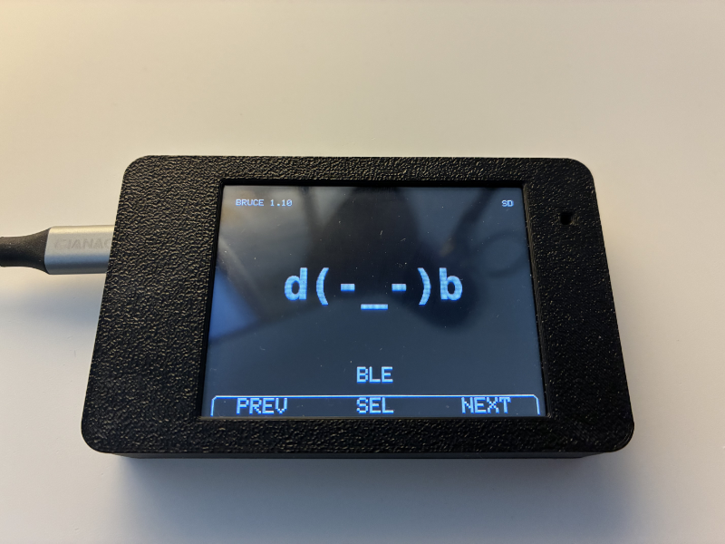
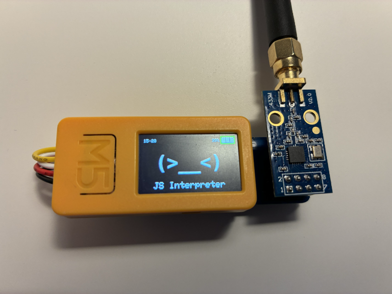
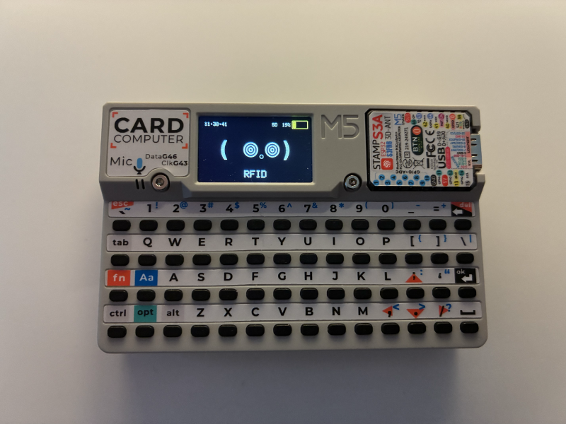

# pwnagotchi Theme

This is a [pwnagotchi](https://github.com/evilsocket/pwnagotchi) inspired theme for [Bruce Predatory ESP32 Firmware](https://github.com/pr3y/Bruce) version 1.10 and above.

|  |  |  |
| --- | --- | --- |
| CYD | M5StickC Plus2 | M5Stack Cardputer |

## Installation

1. Upload the pwnagotchi folder to your SD-card or littlefs.
2. Go to `Config > UI Theme` and select the `pwnagotchi.json` in the  uploaded `pwnagotchi` folder.
3. That's it!

## Customization

You can customize the theme by editing the `pwnagotchi.json` file and/or replace the icons.

## Icons

* ble - `d(-_-)b`
* clock - `(⏲‿‿⏲)`
* config - `(⚙‿⚙ )`
* connect - `( +ᴗ+)`
* files - `(🖧‿🖧¬)`
* fm - `(⌒‿⌒)♫`
* gps - `(⌖⌒⌖)`
* interpreter - `(>__<)`
* ir - `(⏻‿⏻ )`
* nrf - `(~,~)`
* other - `(⌐■_■)`
* rf - `(~﹏~)`
* rfid - `( 𖣠𓈒𖣠)`
* wifi - `(ᯤᴗᯤ)`
